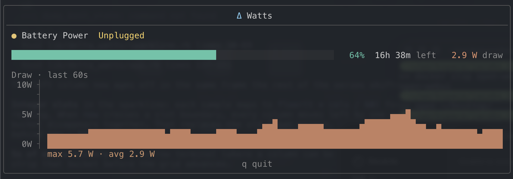

# Δ Watts

A quiet TUI for Mac laptop power: charge, remaining time, live system draw, and the last 60 seconds of history.



macOS only. Quit with `q`.

## Install

```bash
./install.sh
```

That builds the power sampler and adds a `dwatts` alias to your shell profile. Restart the shell (or `source` the profile), then:

```bash
dwatts
```

Needs Ruby 3.0+ and Xcode Command Line Tools (`cc`). Uninstall with `./install.sh --uninstall`.

You can also run it without the alias:

```bash
ruby bin/delta_watts
```

## What it shows

- AC vs battery, charging / unplugged
- Charge bar and percent
- Time remaining, or time to full
- Live system draw (watts)
- 60-second draw plot, auto-scaled

Live watts come from IOReport energy counters and the SMC `PSTR` key — the same class of data as `powermetrics`, without sudo. Charge and runtime still come from the battery pack via `ioreg`.
